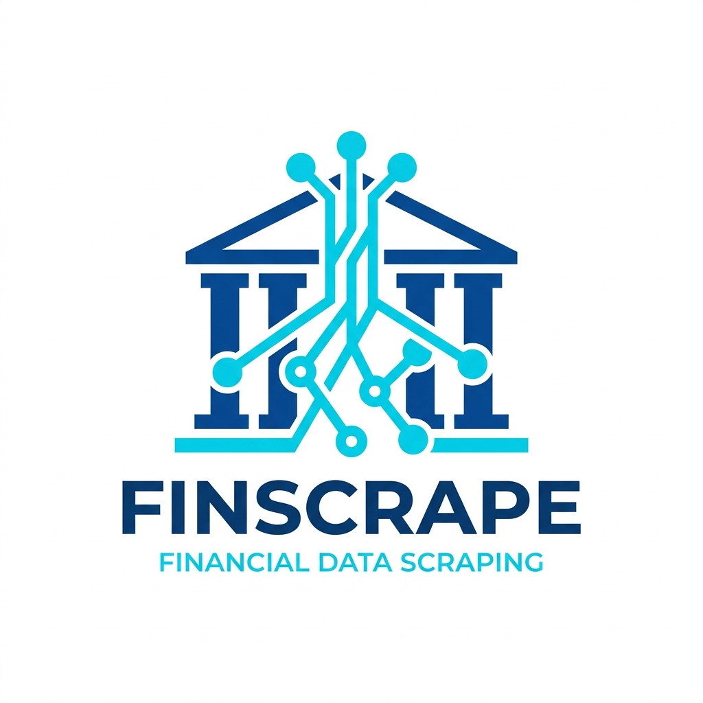

<div align="center">
  
  <h1>OJK BPR Konvensional Financial Reports Scraper</h1>
  <p><em>An automated web scraping engine to extract public financial data of BPR Konvensional banks from the official Otoritas Jasa Keuangan (OJK) website.</em></p>
</div>

---

## 📖 Overview

This project programmatically extracts the 5 primary financial report types (Balance Sheet, Profit & Loss, Asset Quality, Commitments & Contingencies, and Other Information) natively published on the OJK CFS platform. It operates modularly based on the combination of Provinces, Cities, and Banks, ensuring comprehensive database coverage while addressing the underlying complexities of Ext.NET server-side interactions.

## 📁 Project Structure

The codebase is organized following a modern, modular Python architecture:

```text
ojk-bpr-financial-reports-scraper/
├── src/                    # Core Web Scraper Application
│   ├── scraper.py          # Primary OJKScraper Selenium logic 
│   ├── database.py         # SQLite connection & ORM logic
│   ├── config.py           # Constants, file paths, and ExtJS selectors
│   └── excel_parser.py     # DOM-to-data-table parsing logic
│
├── scripts/                # Operations & Automation Scripts
│   ├── fetch_reports.py    # Main script to execute the final report scraping
│   ├── scrape_metadata.py  # Populate baseline Province & City metadata
│   ├── scrape_kota.py      # Extract specific city entities
│   ├── scrape_banks.py     # Extract specific Bank entities 
│   └── check_db.py         # Output database size and health statistics
│
├── main.py                 # Root entry point initializing the operations
├── data/                   # Master SQLite database storage (`ojk_bpr.db`) 
├── logs/                   # Application log output
├── debug/                  # Obsolete ExtJS bypass debugging scripts (For reference)
├── tests/                  # End-to-End tests
├── requirements.txt        # Python dependency requirements
└── .agents/workflows/      # Automated Agent & Workflow ExtJS methodology docs
```

## ⚙️ Setup & Installation

Ensure you have **Python 3.9+** and **Google Chrome** installed.

```bash
# Create a Virtual Environment
python -m venv .venv

# Activate the Environment (Windows)
.venv\Scripts\activate

# Install requirements
pip install -r requirements.txt
```

## 🚀 Usage Guide

**Run directly via the root entry point module:**

```bash
# Scrape all applicable banks (Default: December 2024)
python main.py --bulan Desember --tahun 2024

# Targeted execution for 1 specific Bank (Example: Bali, Denpasar) & limit to 1 bank.
python main.py --bulan Desember --tahun 2024 --provinsi DATI01126 --kota DATI01573 --max-banks 1

# Interactive / Non-headless mode (Displays the visible Chrome UI while running)
python main.py --bulan Desember --tahun 2024 --max-banks 1 --headless
```

## 🗄️ SQLite Database Schema (`data/ojk_bpr.db`)

All scraped operations and progress checkpoints are securely saved to prevent redundant calls in case of system interruptions:

| Table | Core Purpose |
|-------|-----------|
| `provinsi` | Fundamental region codes & names |
| `kabupaten`| City region objects tied to provinces |
| `bank` | Registered BPR entities linked to City codes |
| `jenis_laporan` | Meta dictionary for the 5 OJK report types |
| `scrape_progress` | Track record of which report IDs have been completed |
| `laporan_data` | **Extracted financial row data** |

## 💡 System Architecture: OJK BPR Ext.NET Bypass
The OJK Web Application utilizes a legacy ExtJS wrapper (Ext.NET) which natively overrides and neutralizes ordinary *Native DOM Interaction* standard to typical scraping. The circumvention approaches utilizing DirectEvents are comprehensively documented inside `/.agents/workflows/ojk_scraper_workflow.md` or via the legacy test scripts under `/debug/`.
